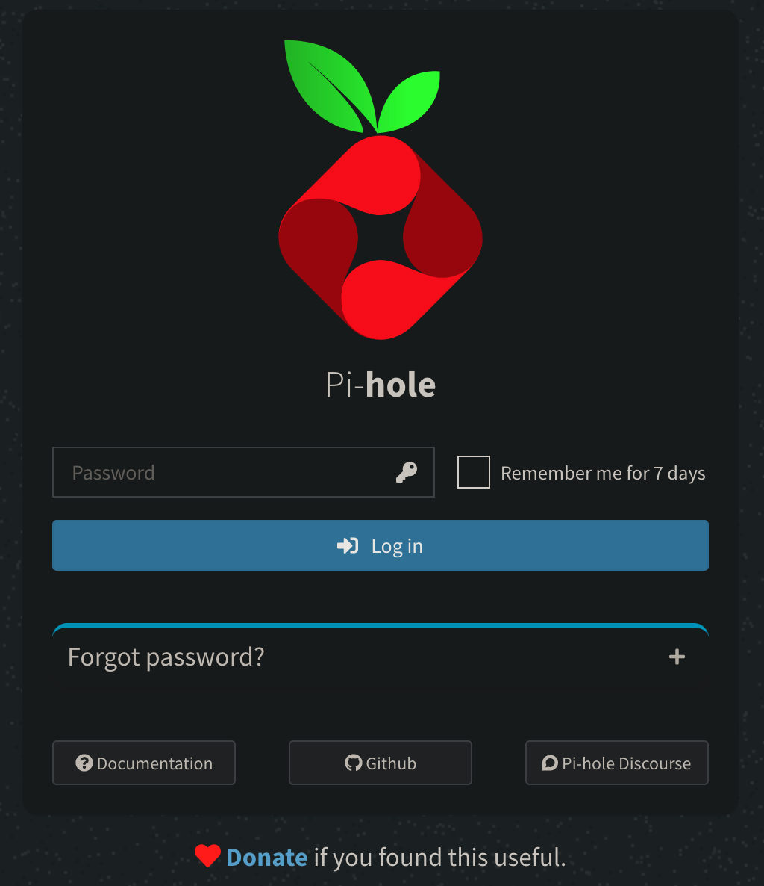
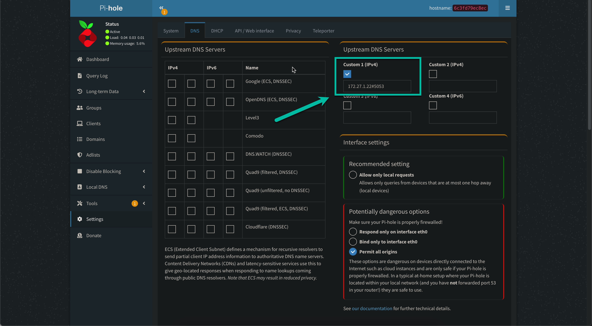

# Pi-hole and Cloudflare Tunnel Client Using Docker Compose

Using [Docker Compose](https://docs.docker.com/compose/) to run [Pi-hole](https://pi-hole.net/) and [Cloudflare Tunnel Client](https://github.com/cloudflare/cloudflared) together to achieve [DNS-Over-HTTPS](https://docs.pi-hole.net/guides/dns/cloudflared/).

# Requirements

- macOS Monterey (12.16.x) or later
- Docker Desktop 4.14.x or later

# Instructions

1. In `./web-password` directory, rename `password.sample.txt` to `password.txt`

2. Change the content of `password.txt` file to set a password for Pi-hole's administrative UI.

3. Make sure Docker Desktop is running by running the following command in the terminal.

```bash
docker --version
```

It should return something like this

```text
Docker version 20.10.21, build baeda1f
```

4. You can change the configuration values of Pi-hole and Cloudflare Tunnel Client in the [docker-compose.yml](./docker-compose.yml) file.

   - Docker Pi-Hole's [Environment Variables](https://github.com/pi-hole/docker-pi-hole/#environment-variables)
   - Cloudflare Tunnel Client's [Environment Variables](https://github.com/cloudflare/cloudflared/blob/master/cmd/cloudflared/proxydns/cmd.go)

5. To start run [start-pihole.sh](./start-pihole.sh)

```bash
sudo ./start-pihole.sh
```

This bash script will:

1. Start Docker Compose in detached mode.
2. Clear the WiFi DNS server
3. Set the WiFi DNS server to localhost (`127.0.0.1`) which Pi-hole will run on TCP port `53`

# Stop Docker Compose and Reset WiFi DNS

Run [stop-pihole.sh](./stop-pihole.sh)

```bash
sudo ./stop-pihole.sh
```

# Pi-hole Web Admin

Once the Pi-hole docker started, you can access Pi-hole's web admin UI at [http://localhost:8061/admin]



Enter a password you set in `./web-password/password.txt` file.

You can check the [Upstream DNS Serves](http://localhost:8061/admin/settings.php?tab=dns) settings and you should see it set to Cloudflare Tunnel Client.


